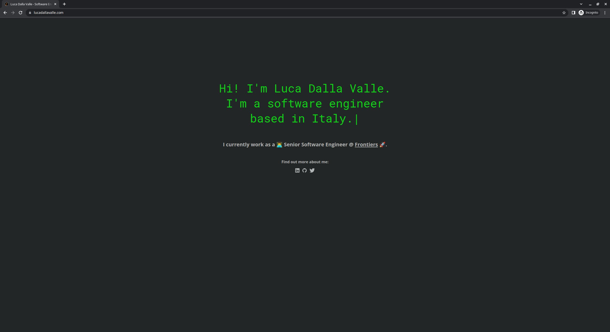

# lucadallavalle.com Website
This is my (simple) personal website hosted at https://www.lucadallavalle.com .

## Features
This is based on my [vanilla website template](https://github.com/undrivendev/template-vanilla-website).

- [Parcel](https://github.com/parcel-bundler/parcel) bundler for the development server and build pipeline
- TypeScript all the way
- [Prettier](https://github.com/prettier/prettier)
- [ESLint](https://github.com/eslint/eslint) with TypeScript support and configured to not interfere with Prettier
- [SASS](https://github.com/sass/sass)

